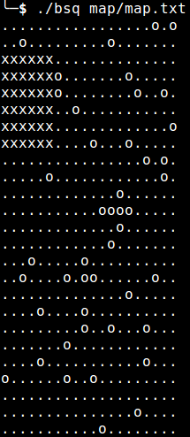

# CPE_2015_BSQ
Epitech first year project : [CPE] BSQ

Deadline : 3 weeks

Beginning of the project : 23/11/2015, 07h42

Group size : 1 person

# BSQ

Find the largest square in a map composed by '.' and 'o'

## Getting started

These instructions will allow you to obtain a copy of the operational project on your local machine for development and testing purposes.

### Prerequisites

What do you need to install the software and how to install it?

```
gcc
make
```

### Installation

Here's how to start the project on your computer

Clone and go in the directory CPE_2015_BSQ

Project compilation

```
make
```

Running project

```
./bsq map/map.txt
```

## Screenshot



## Build with

* [C](https://en.wikipedia.org/wiki/C_(programming_language))

## Auteurs

* **David Munoz** - [DavidMunoz-dev](https://github.com/davidmunoz-dev)
